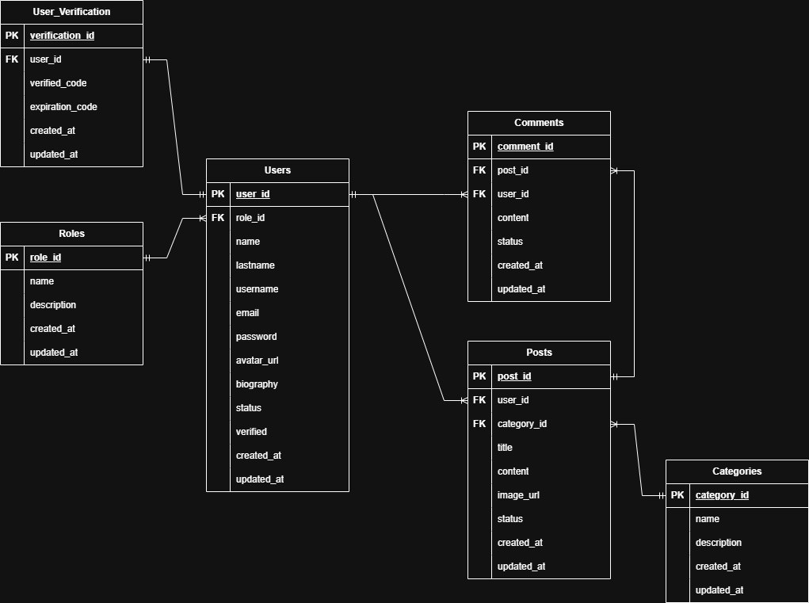

# Documentación de la API Backend - StarWiki

## 1. Versionado de la API

La API utiliza un esquema de versionado basado en la URL. Actualmente, la versión activa es `v3`.

### Cambios en la Versión 3

- Se agregó soporte para roles y permisos.
- Se mejoró la seguridad con la implementación de `helmet` y `express-rate-limit`.
- Se optimizó el manejo de errores con respuestas más descriptivas.

### Versiones Anteriores

- **v2**: Introducción de autenticación con JWT.
- **v1**: Versión inicial con endpoints básicos para posts.

> **Nota**: Se recomienda a los desarrolladores migrar a la última versión para aprovechar las nuevas características y mejoras de seguridad.

## 2. Dependencias

### Dependencias Principales

- `npm axios` - Cliente HTTP para realizar solicitudes
- `npm bcryptjs` - Hashing de contraseñas
- `npm body-parser` - Parseo de cuerpos en solicitudes HTTP
- `npm chalk` - Coloreado de texto en la consola
- `npm cors` - Permite solicitudes entre dominios
- `npm dotenv` - Manejo de variables de entorno
- `npm express` - Framework de Node.js para aplicaciones backend
- `npm express-rate-limit` - Limitación de solicitudes para seguridad
- `npm express-validator` - Validación y saneamiento de datos
- `npm helmet` - Seguridad HTTP mediante cabeceras
- `npm jsonwebtoken` - Generación y verificación de tokens JWT
- `npm morgan` - Middleware de registro de solicitudes HTTP
- `npm multer` - Subida de archivos (imágenes, documentos, etc.)
- `npm nodemailer` - Envío de correos electrónicos
- `npm pg` - Cliente PostgreSQL
- `npm pg-hstore` - Serialización de datos para PostgreSQL
- `npm sequelize` - ORM para bases de datos SQL
- `npm sharp` - Procesamiento de imágenes
- `npm swagger-jsdoc` - Documentación automática de API
- `npm swagger-ui-express` - Interfaz de usuario para documentación de API
- `npm winston` - Registro y manejo de logs

### Dependencias de Desarrollo

- `npm @faker-js/faker` - Generación de datos falsos para pruebas
- `npm jest -D` - Framework de pruebas
- `npm nodemon -D` - Reinicia automáticamente el servidor en desarrollo
- `npm standard -D` - Estándares de código
- `npm supertest -D` - Pruebas de endpoints HTTP
- `npm swagger-autogen -D` - Generación automática de documentación Swagger

## 3. Autenticación y Autorización

La API utiliza tokens JWT (JSON Web Tokens) para autenticar a los usuarios. A continuación, se describe cómo funciona el proceso de autenticación:

1. **Obtener un Token**:
   - Los usuarios deben iniciar sesión utilizando el endpoint `/api/v3/auth/login`.
   - Si las credenciales son correctas, el servidor devolverá un token JWT.

2. **Incluir el Token en las Solicitudes**:
   - El token debe incluirse en el encabezado `Authorization` de las solicitudes protegidas.
   - Ejemplo:
     ```
     :Authorization Bearer <tu_token_jwt>
     ```

3. **Duración del Token**:
   - Los tokens tienen una duración limitada. Si el token expira, puedes usar el endpoint `/api/v3/auth/refresh-token` para obtener uno nuevo.

4. **Roles y Permisos**:
   - Algunos endpoints requieren roles específicos (por ejemplo, `ADMIN`, `EDITOR`, `USER`). Asegúrate de que el usuario tenga el rol adecuado para acceder al recurso.

## 4. Endpoints API

### Autenticación

| Método | Endpoint                              | Descripción                                                     | Protección                                       |
| ------ | ------------------------------------- | --------------------------------------------------------------- | ------------------------------------------------ |
| POST   | `/api/v3/auth/register`               | Registra un usuario                                             | N/A                                              |
| POST   | `/api/v3/auth/login`                  | Inicia sesión de usuario                                        | N/A                                              |
| POST   | `/api/v3/auth/send-verification-code` | Envía un código de verificación al correo                       | Solo usuarios autenticados (ADMIN, EDITOR, USER) |
| POST   | `/api/v3/auth/verify-account`         | Verifica la cuenta del usuario con código de verificación       | Solo usuarios autenticados (ADMIN, EDITOR, USER) |
| POST   | `/api/v3/auth/reset-password`         | Restablece la contraseña del usuario con código de verificación | Solo usuarios autenticados (ADMIN, EDITOR, USER) |
| POST   | `/api/v3/auth/refresh-token`          | Refresca el token de autenticación                              | Solo usuarios autenticados (ADMIN, EDITOR, USER) |

### Roles

| Método | Endpoint                 | Descripción                         | Protección                         |
| ------ | ------------------------ | ----------------------------------- | ---------------------------------- |
| GET    | `/api/v3/roles/`         | Obtiene todos los roles disponibles | Solo usuarios autenticados (ADMIN) |
| GET    | `/api/v3/roles/:role_id` | Obtiene un rol específico por ID    | Solo usuarios autenticados (ADMIN) |
| POST   | `/api/v3/roles/`         | Crea un rol                         | Solo usuarios autenticados (ADMIN) |
| PATCH  | `/api/v3/roles/:role_id` | Actualiza un rol                    | Solo usuarios autenticados (ADMIN) |
| DELETE | `/api/v3/roles/:role_id` | Elimina un rol                      | Solo usuarios autenticados (ADMIN) |

### Usuarios

| Método | Endpoint                 | Descripción                                     | Protección                                       |
| ------ | ------------------------ | ----------------------------------------------- | ------------------------------------------------ |
| GET    | `/api/v3/users/`         | Obtiene todos los usuarios disponibles          | Solo usuarios autenticados (ADMIN)               |
| GET    | `/api/v3/users/:user_id` | Obtiene un usuario específico por ID            | Solo usuarios autenticados (ADMIN, EDITOR, USER) |
| POST   | `/api/v3/users/`         | Crea un usuario                                 | Solo usuarios autenticados (ADMIN)               |
| PATCH  | `/api/v3/users/:user_id` | Actualiza un usuario                            | Solo usuarios autenticados (ADMIN, EDITOR, USER) |
| PATCH  | `/api/v3/users/:user_id` | Desactiva un usuario con código de verificación | Solo usuarios autenticados (ADMIN, EDITOR, USER) |
| PATCH  | `/api/v3/users/:user_id` | Reactiva un usuario con código de verificación  | Solo usuarios autenticados (ADMIN, EDITOR, USER) |
| DELETE | `/api/v3/users/:user_id` | Elimina un usuario                              | Solo usuarios autenticados (ADMIN)               |

### Categorías

| Método | Endpoint                           | Descripción                              | Protección                         |
| ------ | ---------------------------------- | ---------------------------------------- | ---------------------------------- |
| GET    | `/api/v3/categories/`              | Obtiene todos las categorías disponibles | N/A                                |
| GET    | `/api/v3/categories/:category_id`  | Obtiene una categoría específica por ID  | N/A                                |
| GET    | `/api/v3/categories/by-name/name:` | Obtiene una categoría por nombre         | N/A                                |
| POST   | `/api/v3/categories/`              | Crea una categoría                       | Solo usuarios autenticados (ADMIN) |
| PATCH  | `/api/v3/categories/:category_id`  | Actualiza una categoría                  | Solo usuarios autenticados (ADMIN) |
| DELETE | `/api/v3/categories/:category_id`  | Elimina una categoría                    | Solo usuarios autenticados (ADMIN) |

### Posts

| Método | Endpoint                              | Descripción                           | Protección                                 |
| ------ | ------------------------------------- | ------------------------------------- | ------------------------------------------ |
| GET    | `/api/v3/posts/`                      | Obtiene todos los posts disponibles   | N/A                                        |
| GET    | `/api/v3/posts/:post_id`              | Obtiene un post específico por ID     | N/A                                        |
| GET    | `/api/v3/posts/by-title/:title`       | Obtiene un post por nombre            | N/A                                        |
| GET    | `/api/v3/posts/user/:user_id`         | Obtiene todos los posts por usuario   | N/A                                        |
| GET    | `/api/v3/posts/category/:category:id` | Obtiene todos los posts por categoría | N/A                                        |
| GET    | `/api/v3/posts/search`                | Búsqueda de posts                     | N/A                                        |
| POST   | `/api/v3/posts/`                      | Crea un post                          | Solo usuarios autenticados (ADMIN, EDITOR) |
| PATCH  | `/api/v3/posts/:post_id`              | Actualiza un post                     | Solo usuarios autenticados (ADMIN, EDITOR) |
| DELETE | `/api/v3/posts/:post_id`              | Elimina un post                       | Solo usuarios autenticados (ADMIN, EDITOR) |

### Comentarios

| Método | Endpoint                         | Descripción                               | Protección                                       |
| ------ | -------------------------------- | ----------------------------------------- | ------------------------------------------------ |
| GET    | `/api/v3/comments/`              | Obtiene todos los comentarios disponibles | Solo usuarios autenticados (ADMIN, EDITOR, USER) |
| GET    | `/api/v3/comments/:comment_id`   | Obtiene un comentario específico por ID   | Solo usuarios autenticados (ADMIN, EDITOR, USER) |
| GET    | `/api/v3/comments/post/:post_id` | Obtiene todos los comentarios por post    | Solo usuarios autenticados (ADMIN, EDITOR, USER) |
| POST   | `/api/v3/comments/`              | Crea un comentario                        | Solo usuarios autenticados (ADMIN, EDITOR, USER) |
| PATCH  | `/api/v3/comments/:comment_id`   | Actualiza un comentario                   | Solo usuarios autenticados (ADMIN, EDITOR, USER) |
| DELETE | `/api/v3/comments/:comment_id`   | Elimina un comentario                     | Solo usuarios autenticados (ADMIN, EDITOR, USER) |

### Errores Comunes

A continuación, se describen los errores más comunes que puede devolver la API:

| Código | Descripción           | Causa                                                            |
| ------ | --------------------- | ---------------------------------------------------------------- |
| 400    | Bad Request           | La solicitud tiene parámetros inválidos o está mal formada.      |
| 401    | Unauthorized          | El usuario no está autenticado o el token JWT es inválido.       |
| 403    | Forbidden             | El usuario no tiene permisos para acceder al recurso solicitado. |
| 404    | Not Found             | El recurso solicitado no existe.                                 |
| 500    | Internal Server Error | Ocurrió un error inesperado en el servidor.                      |

### Ejemplos

#### Ejemplo de Solicitud

**POST** `/api/v3/auth/login`

**Request Body**:

```json
{
  "email": "user@example.com",
  "password": "securepassword123"
}
```

#### Ejemplo de Respuesta Exitosa

```json
{
  "success": true,
  "status": 200,
  "token": "eyJhbGciOiJIUzI1NiIsInR5cCI6IkpXVCJ9...",
  "message": "Inicio de sesión exitoso."
}
```

#### Ejemplo de Respuesta de Error

```json
{
  "success": false,
  "status": 401,
  "error": "Unauthorized",
  "message": "El token JWT es inválido o ha expirado."
}
```

## 5. Base de Datos

- Se usa PostgreSQL como sistema de gestión de bases de datos.
- Se usa Sequelize como ORM para interactuar con la base de datos.

### Diagrama E-R



### Relaciones entre Entidades

| Entidad A  | Relación | Entidad B         | Lectura Lógica                                  |
| ---------- | -------- | ----------------- | ----------------------------------------------- |
| Roles      | 1:N      | Users             | Un rol define a muchos usuarios                 |
| Users      | 1:1      | User_Verification | Un usuario tiene un único registro de seguridad |
| Users      | 1:N      | Posts             | Un usuario escribe múltiples posts              |
| Categories | 1:N      | Posts             | Una categoría agrupa múltiples posts            |
| Users      | 1:N      | Comments          | Un usuario escribe múltiples comentarios        |
| Posts      | 1:N      | Comments          | Un post recibe múltiples comentarios            |

## 6. Seguridad

- **bcryptjs**: Se utiliza para encriptar contraseñas antes de almacenarlas en la base de datos.
- **jsonwebtoken**: Se utiliza para generar y verificar tokens JWT para la autenticación.
- **helmet**: Configura cabeceras HTTP seguras para proteger contra ataques comunes como XSS.
- **express-rate-limit**: Limita el número de solicitudes por IP para prevenir ataques de fuerza bruta.

## 7. Preguntas Frecuentes (FAQ)
